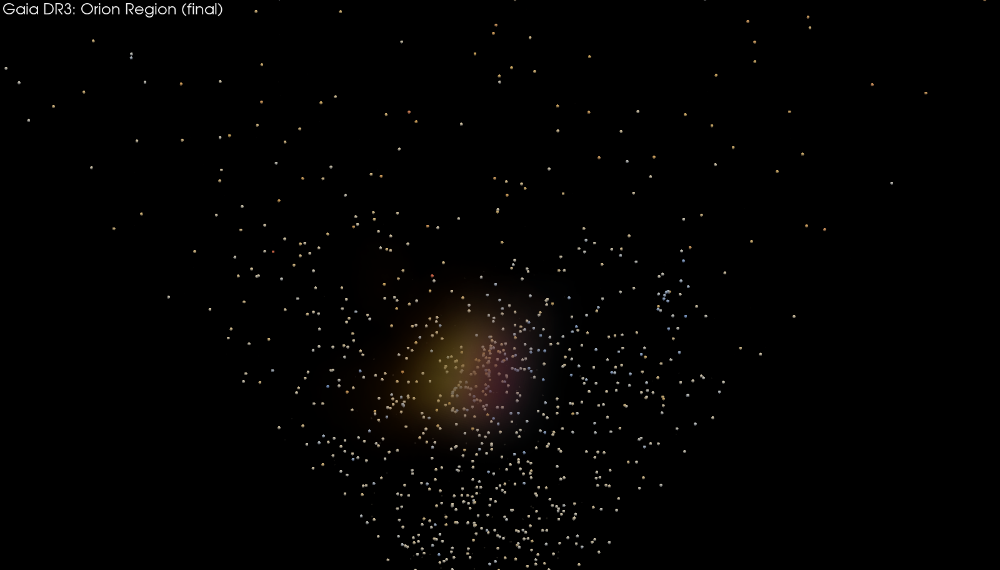
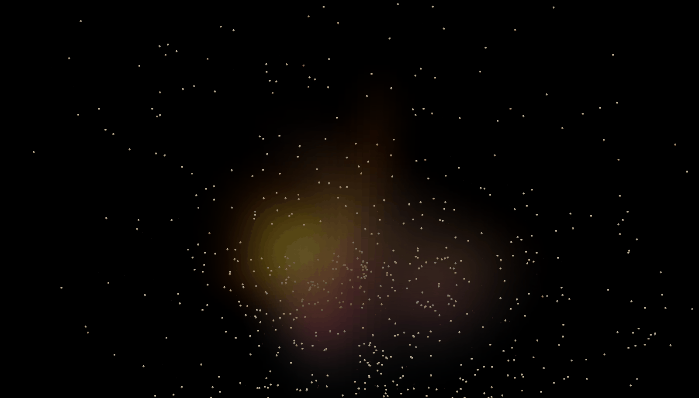

# Gaia Orion visualization



An interactive and cinematic 3D visualization of stars near Orion using
[Gaia DR3](https://www.cosmos.esa.int/web/gaia/dr3) astrometry and photometry.

The **star positions and measured attributes come from Gaia DR3**. The colored
nebula/cloud volumes are **synthetic artistic effects** generated around selected
stars. This project is not a physical reconstruction of Orion's gas or dust.

## What it does

1. Queries a three-degree cone around Orion from `gaiadr3.gaia_source`.
2. Filters to stars with usable parallax, color, and brightness measurements.
3. Converts parallax to an approximate distance in parsecs.
4. Projects right ascension, declination, and distance into local 3D coordinates.
5. Renders the result either as interactive Plotly HTML or with PyVista.
6. Caches the Gaia table as FITS and, when available, Parquet.

## Gaia query

The ADQL query selects up to 8,000 sources inside a cone centered at:

- right ascension: `83.82208°`
- declination: `-5.39111°`
- radius: `3°`

Selected Gaia DR3 columns:

| Column | Use |
| --- | --- |
| `source_id` | Stable Gaia source identifier |
| `ra`, `dec` | Sky position in ICRS degrees |
| `parallax` | Distance estimate input, in milliarcseconds |
| `parallax_over_error` | Relative parallax-quality signal |
| `phot_g_mean_mag` | Apparent G-band brightness |
| `bp_rp` | Gaia color index used for approximate star color |

The query keeps parallaxes from `1` to `8` mas, requires
`parallax_over_error >= 5`, and limits apparent magnitude to `G < 15.5`. It orders
by Gaia's `random_index`, so the row limit does not simply select one positional
slice of the cone.

The quality threshold is a practical visualization choice, not a complete
astrometric-quality model.

## From parallax to local 3D coordinates

For positive parallax `p` in milliarcseconds, the code uses the simple inverse:

```text
distance_pc = 1000 / p
```

Astropy constructs `SkyCoord` values from `(ra, dec, distance)`. Relative to the
query center, the code calculates angular separation `s` and position angle `a`,
then derives local coordinates:

```text
x = distance × tan(s) × sin(a)
y = distance × tan(s) × cos(a)
z = distance - median(distance)
```

`x` and `y` are transverse offsets and `z` is relative line-of-sight depth, all in
parsecs. PyVista applies additional display-only scaling to make the structure
legible.

The inverse-parallax estimate is reasonable for this filtered demonstration but is
not a Bayesian distance inference. It becomes biased for noisy or non-positive
parallaxes; those are outside this query.

## Plotly and PyVista versions

| Implementation | Output | Best for |
| --- | --- | --- |
| `gaia_orion_flythrough.py` | `gaia_orion_local_3d.html` | Browser interaction, hover data, inspecting individual stars |
| `gaia_orion_pyvista.py` | PNG, GIF, or MP4 | Volume rendering, an orbiting camera, presentation visuals |

Both use Gaia positions and photometry. Their nebula effects differ:

- Plotly adds seeded translucent point clouds around bright-star anchors.
- PyVista builds seeded 3D density fields from Gaussian blobs and renders them as
  warm/cool volumes.

These clouds are repeatable because the random seed is fixed, but they remain
synthetic and should not be interpreted as Gaia observations of gas or dust.

## Setup

Python 3.11+ is recommended.

On Ubuntu, PyVista may need OpenGL runtime libraries:

```bash
sudo apt-get install -y libgl1 libglx-mesa0 libegl1
```

Create an environment and install all features:

```bash
python3 -m venv .venv
source .venv/bin/activate
python -m pip install --upgrade pip
python -m pip install -e ".[pyvista,analysis,dev]"
```

## Run

Interactive Plotly visualization (should open on http://127.0.0.1:43701/):

```bash
python gaia_orion_flythrough.py
```

PyVista screenshot:

```bash
python gaia_orion_pyvista.py --mode screenshot --quality final
```

Interactive PyVista window (WIP very early stages):

```bash
python gaia_orion_pyvista.py --mode interactive --quality preview
```

The first run queries Gaia and creates `cache/orion_gaia.fits` plus a Parquet cache
when `pyarrow` is available. Add `--refresh` to the PyVista command when query
columns or filters change.

## Generate a GIF

Fast draft:

```bash
python gaia_orion_pyvista.py --mode gif --quality draft --frames 48
```

README-quality render:

```bash
python gaia_orion_pyvista.py --mode gif --quality final
```

This writes `gaia_orion_orbit.gif`



To generate an MP4 instead:

```bash
python gaia_orion_pyvista.py --mode mp4 --quality final
```

## Data analysis

Generate descriptive statistics, distance bins, correlations, and three plots:

```bash
python gaia_analysis.py --refresh
```

Later runs can reuse the cache:

```bash
python gaia_analysis.py
```

Outputs are written under `analysis/`:

- `gaia-analysis.md`
- `distance-histogram.png`
- `distance-vs-color.png`
- `parallax-quality.png`

The report includes `DataFrame.describe()`, distance-bin aggregates, and the
correlation matrix for `distance_pc`, `bp_rp`, `phot_g_mean_mag`, and
`parallax_over_error`. These are exploratory summaries, not astrophysical claims.

## Repository structure

| File | Purpose |
| --- | --- |
| `gaia_orion_flythrough.py` | Gaia query, coordinate derivation, Plotly rendering |
| `gaia_orion_pyvista.py` | PyVista screenshot and orbit animation |
| `gaia_analysis.py` | pandas analysis and matplotlib plots |
| `pyproject.toml` | Runtime, visualization, analysis, and development dependencies |

## Limitations

- The plotted cone is a selected sample, not a complete Orion census.
- Simple inverse parallax is not a full distance posterior.
- `BP-RP` is mapped to display colors approximately.
- Apparent magnitude affects marker size; it is not intrinsic luminosity.
- Local-coordinate and PyVista scaling choices emphasize visual clarity.
- The nebula/cloud rendering is synthetic artwork, not measured dust or gas.

## Attribution

This project uses data from the European Space Agency mission
[Gaia](https://www.cosmos.esa.int/gaia), processed by the Gaia Data Processing and
Analysis Consortium (DPAC).
