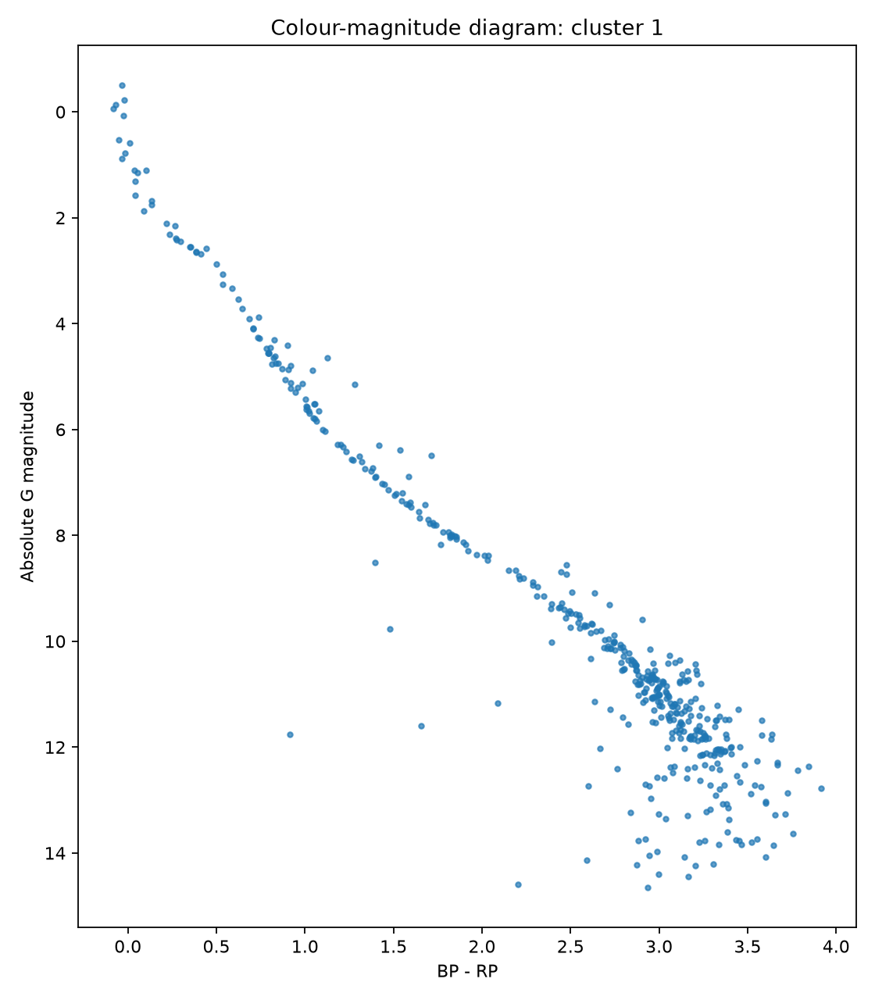

# Learning ML in Python on astronomy data

## Pleiades - detect cluster using DBSCAN

```
           Gaia catalogue
                 │
                 ▼
      pandas cleaning/filtering
                 │
                 ▼
         feature selection
                 │
                 ▼
          StandardScaler
                 │
                 ▼
             DBSCAN
                 │
          ┌──────┴──────┐
          ▼             ▼
      candidate        noise
       cluster        / field
          │
   ┌──────┼─────────┐
   ▼      ▼         ▼
motion   sky       CMD
```

DBSCAN - Density Based Spatial Clustering of Applications with Noise

From 720 Gaia sources passing broad quality and distance filters, DBSCAN identified a single dense group of 392 stars with median parallax 7.36 mas and proper motion approximately (+19.75, −45.37) mas/yr — consistent with the Pleiades

DBSCAN found one dense cluster:

```
392 stars
median parallax = 7.361 mas
median pmra     = +19.749 mas/yr
median pmdec    = -45.370 mas/yr
```

That parallax corresponds to roughly 136 pc, which is right in the expected Pleiades distance range. And the proper-motion concentration around roughly (20, -45) mas/yr is exactly the characteristic Pleiades motion used in Gaia-based selection examples. So DBSCAN recovered the known cluster without being given that proper-motion target

```
Select a broad Gaia sample =>
  scale astrometric features =>
  DBSCAN without known Pleiades motion labels =>
  recover a compact moving group =>
  validate through a colour–magnitude sequence
```

### Proper-motion plot



The yellow DBSCAN cluster is a very compact blob around roughly (pmra, pmdec) ≈ (20, -45) while the field stars are widely dispersed. This is exactly the structure we hoped unsupervised clustering would recover.

### CMD


Cluster 0 forms a very clear stellar sequence from hot/blue bright stars down to cool/red faint stars. That is strong independent evidence that DBSCAN did not merely find an accidental numerical clump.

### Sky plot


The yellow candidates are spread across most of your 1° cone rather than forming an obvious dense central patch. That is not necessarily wrong—the Pleiades extends well beyond its bright visual core—but it means I would not yet call all 392 stars confirmed members.

# Python astronomy data visualization

## Gaia Orion


An interactive and cinematic 3D visualization of stars near Orion using
[Gaia DR3](https://www.cosmos.esa.int/web/gaia/dr3) dataset.

The **star positions and measured attributes come from Gaia DR3**. The colored
nebula/cloud volumes are **artistic effects** generated around selected
stars.

## What it does

1. Queries a three-degree cone around Orion from `gaiadr3.gaia_source`.
2. Filters to stars with usable parallax, color, and brightness measurements.
3. Converts parallax to an approximate distance in parsecs.
4. Projects right ascension, declination, and distance into local 3D coordinates.
5. Renders the result either as interactive Plotly HTML or with PyVista.
6. Caches the Gaia table as FITS and, when available, Parquet.

## Gaia query

The [ADQL query](https://gaia.aip.de/cms/services/adql-postgresql/) selects up to 8,000 sources inside a cone centered at:
- right ascension: `83.82208°`
- declination: `-5.39111°`
- radius: `3°`

Selected columns:

| Column | Use |
| --- | --- |
| `ra`, `dec` | sky position in ICRS degrees |
| `parallax` | distance estimate, in millis |
| `parallax_over_error` | relative parallax-quality signal |
| `phot_g_mean_mag` | G-band brightness |
| `bp_rp` | Gaia color index used for approximate star color |

The query keeps parallaxes from `1` to `8` mas, requires
`parallax_over_error >= 5`, and limits apparent magnitude to `G < 15.5`. It orders
by Gaia's `random_index`, so the row limit does not simply select one positional
slice of the cone.

The quality threshold is a practical visualization choice, not a complete
astrometric-quality model.

## From parallax to local 3D coordinates

For positive parallax `p` in milliarcseconds, the code uses the simple inverse:

```text
distance_pc = 1000 / p
```

Astropy constructs `SkyCoord` values from `(ra, dec, distance)`. Relative to the
query center, the code calculates angular separation `s` and position angle `a`,
then derives local coordinates:

```text
x = distance × tan(s) × sin(a)
y = distance × tan(s) × cos(a)
z = distance - median(distance)
```

`x` and `y` are transverse offsets and `z` is relative line-of-sight depth, all in
parsecs. PyVista applies additional display-only scaling to make the structure
legible.

The inverse-parallax estimate is reasonable for this filtered demonstration but is
not a Bayesian distance inference. It becomes biased for noisy or non-positive
parallaxes; those are outside this query.

## Plotly and PyVista versions

| Implementation | Output | Best for |
| --- | --- | --- |
| `gaia_orion_flythrough.py` | `gaia_orion_local_3d.html` | Browser interaction, hover data, inspecting individual stars |
| `gaia_orion_pyvista.py` | PNG, GIF, or MP4 | Volume rendering, an orbiting camera, presentation visuals |

Both use Gaia positions and photometry. Their nebula effects differ:

- Plotly adds seeded translucent point clouds around bright-star anchors.
- PyVista builds seeded 3D density fields from Gaussian blobs and renders them as
  warm/cool volumes.

These clouds are repeatable because the random seed is fixed, but they remain
synthetic and should not be interpreted as Gaia observations of gas or dust.

## Setup

```bash
python3 -m venv .venv
source .venv/bin/activate
python -m pip install --upgrade pip
python -m pip install -e ".[pyvista,analysis,dev]"
```

on Ubuntu, PyVista needed OpenGL libraries:

```bash
sudo apt-get install -y libgl1 libglx-mesa0 libegl1
```

## Run

Interactive Plotly visualization (should open on http://127.0.0.1:43701/):

```bash
python gaia_orion_flythrough.py
```

PyVista screenshot:

```bash
python gaia_orion_pyvista.py --mode screenshot --quality final
```

Interactive PyVista window (WIP very early stages):

```bash
python gaia_orion_pyvista.py --mode interactive --quality preview
```

The first run queries Gaia and creates `cache/orion_gaia.fits` plus a Parquet cache
when `pyarrow` is available. Add `--refresh` to the PyVista command when query
columns or filters change.

## Generate a GIF

Fast draft:

```bash
python gaia_orion_pyvista.py --mode gif --quality draft --frames 48
```

README-quality render:

```bash
python gaia_orion_pyvista.py --mode gif --quality final
```

This writes `gaia_orion_orbit.gif`


To generate an MP4 instead:

```bash
python gaia_orion_pyvista.py --mode mp4 --quality final
```

## Data analysis

Generate descriptive statistics, distance bins, correlations, and three plots:

```bash
python gaia_analysis.py --refresh
```

Later runs can reuse the cache:

```bash
python gaia_analysis.py
```

Outputs are written under `analysis/`:

- `gaia-analysis.md`
- `distance-histogram.png`
- `distance-vs-color.png`
- `parallax-quality.png`

The report includes `DataFrame.describe()`, distance-bin aggregates, and the
correlation matrix for `distance_pc`, `bp_rp`, `phot_g_mean_mag`, and
`parallax_over_error`. These are exploratory summaries, not astrophysical claims.

## Limitations

- The plotted cone is a selected sample, not a complete Orion census.
- Simple inverse parallax is not a full distance posterior.
- `BP-RP` is mapped to display colors approximately.
- Apparent magnitude affects marker size; it is not intrinsic luminosity.
- Local-coordinate and PyVista scaling choices emphasize visual clarity.
- The nebula/cloud rendering is synthetic artwork, not measured dust or gas.

## Resources

* [astroML](https://www.astroml.org/examples) Python project, built around statistics and ML on astronomical datasets. Its examples include classification, regression, density estimation, dimensionality reduction, clustering and time-series analysis using NumPy/scikit-learn/Astropy
* 2023 study used Gaia DR3 + DBSCAN on Pleiades, Praesepe and Blanco 1; it identified 958 Pleiades members: [A Gaia astrometric view of the open clusters Pleiades, Praesepe and Blanco 1 - Jeison Alfonso, Alejandro García-Varela - Astrometry & Astrophysics Vol 677](https://www.aanda.org/articles/aa/full_html/2023/09/aa46569-23/aa46569-23.html)
* 2024 study used Gaia DR3 + DBSCAN to twelve open clusters (NGC 2264, NGC 2682, NGC 2244, NGC 3293, NGC 6913, NGC 7142, IC 1805, NGC 6231, NGC 2243, NGC 6451, NGC 6005, NGC 6583) and validated the resulting memberships with colour-magnitude diagrams and spectroscopic data [Membership determination in open clusters using the DBSCAN Clustering Algorithm - Mudasir Raja, Priya Hasan, Md Mahmudunnobe, Md Saifuddin, S N Hasan](https://arxiv.org/abs/2404.10477)