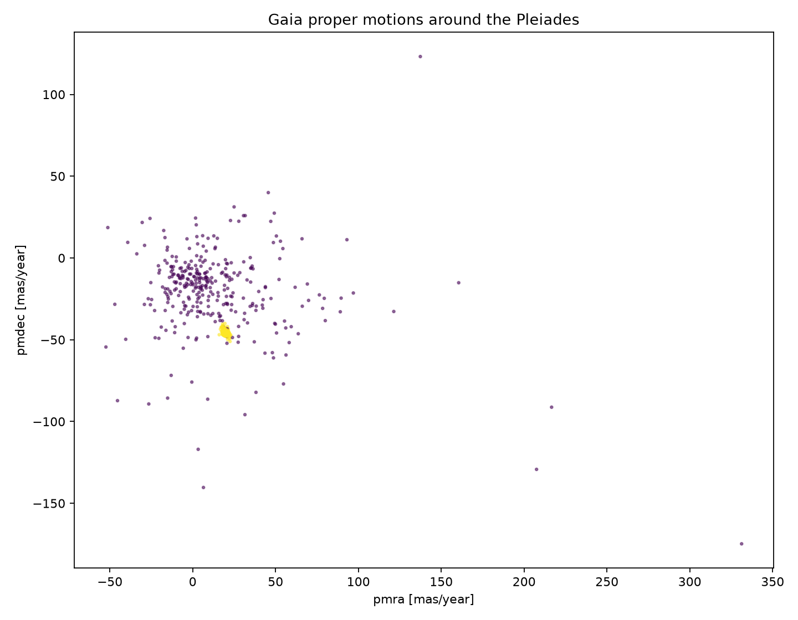
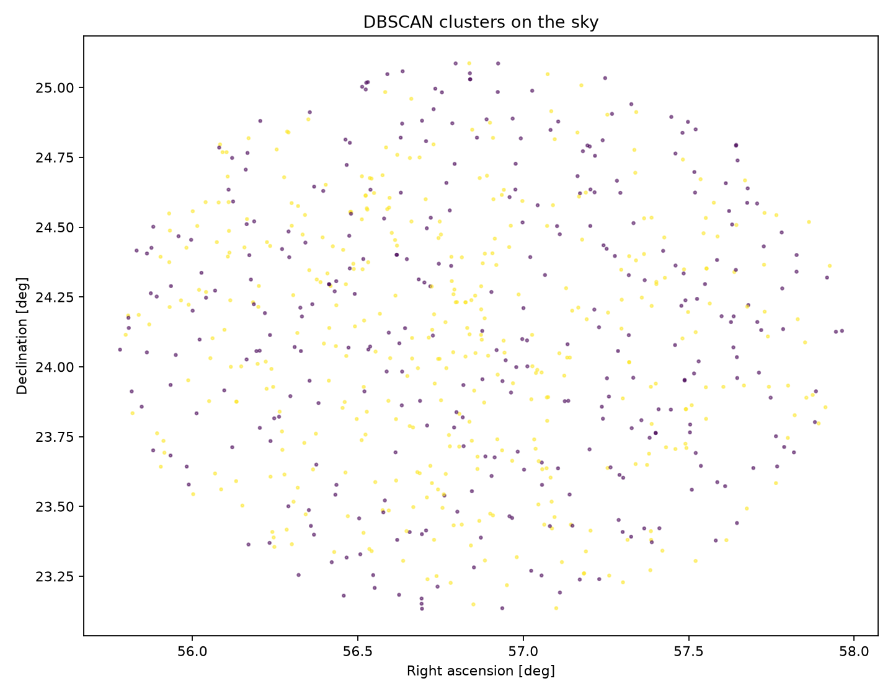
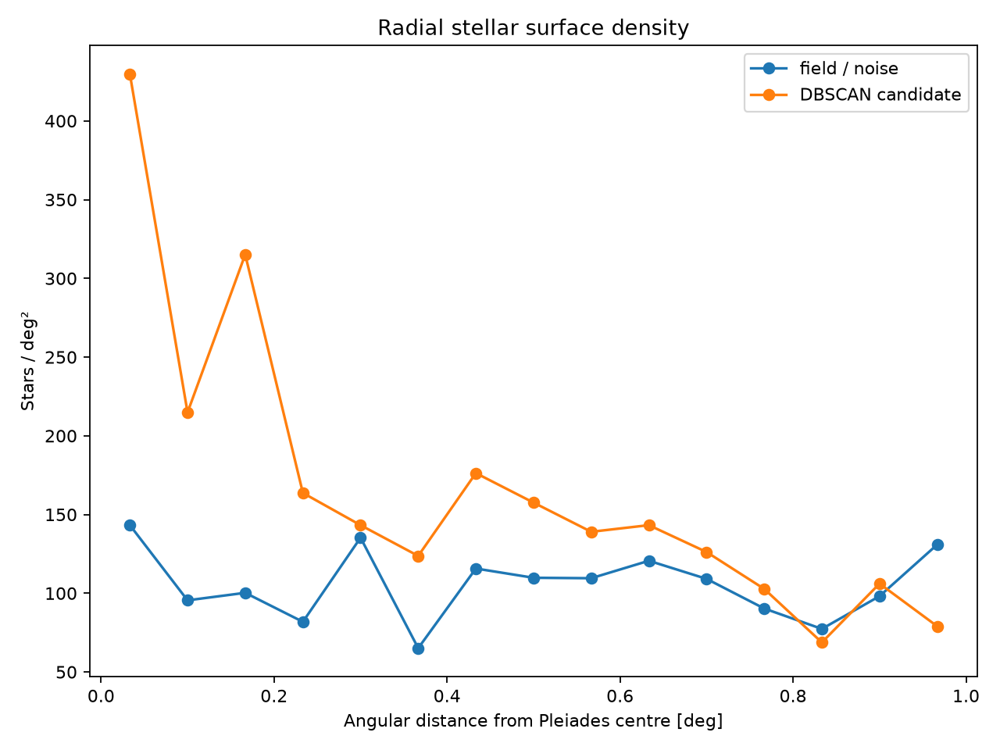
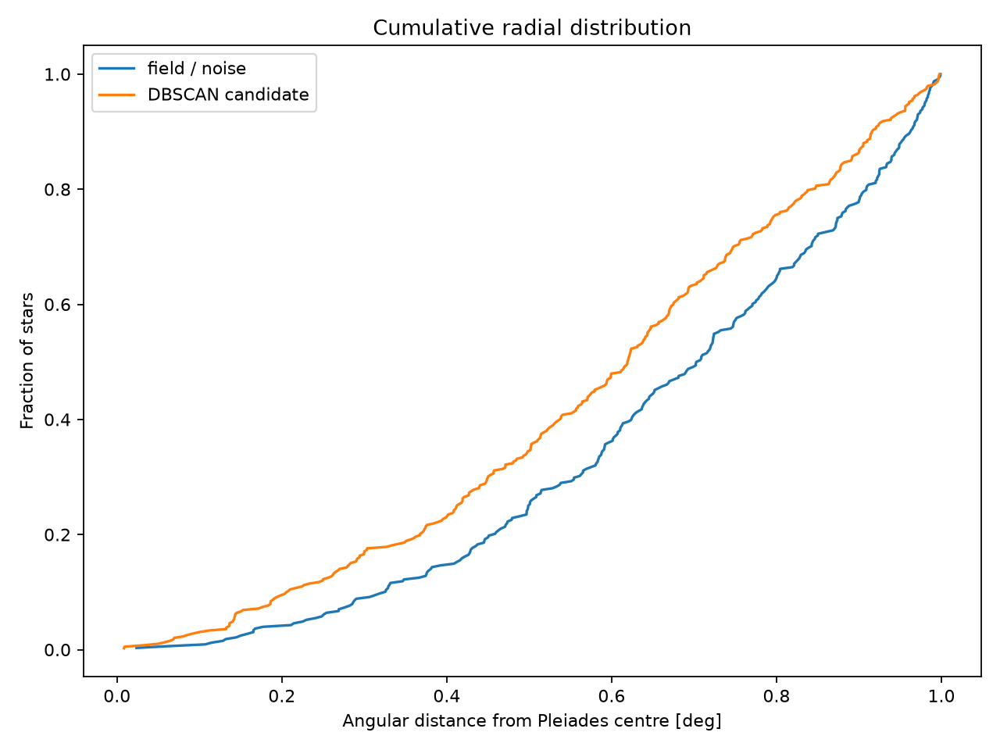
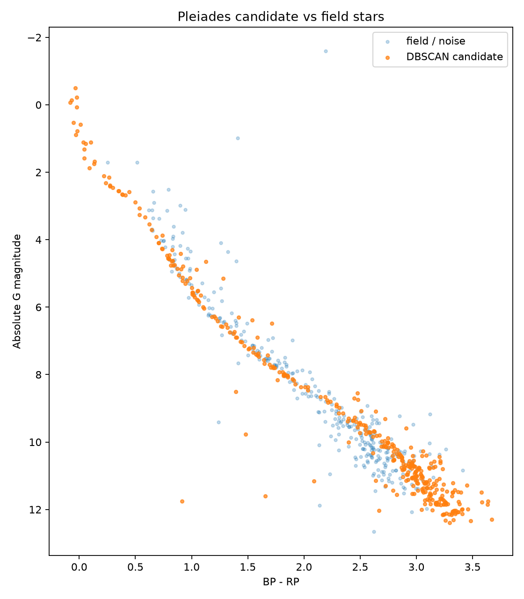

# Learning ML in Python on astronomy data

## Pleiades - detect cluster using DBSCAN

Approach:
```
query Gaia dataset
-> pandas cleaning/filtering
-> feature selection
-> StandardScaler
-> run skylearn unsupervised learning - DBSCAN
-> visualise candidate cluster and data (results + noise): motion, sky, CMD (colour–magnitude sequence)
```

Results:
Gaia query returned: 720 sources (stars)
DBSCAN identified a single dense group
```
392 stars
median parallax = 7.361 mas
median pmra     = +19.749 mas/yr
median pmdec    = -45.370 mas/yr
```

From parallax distance is 1000 / 7.36 = 136 pc


* Proper-motion plot



The yellow DBSCAN cluster is a very compact blob around roughly (pmra, pmdec) ≈ (20, -45) while the field stars are widely dispersed. This is exactly the structure we hoped unsupervised clustering would recover.

* Sky plot



The yellow candidates are spread across most of 1° cone rather than forming an obvious dense central patch.
That looked like something worth investigate further:




* CMD



Cluster 0 forms a nice stellar sequence from hot/blue bright stars
down to cool/red faint stars.

That is nice evidence supporting claim that DBSCAN did not find accidental data.

## Resources

* [astroML](https://www.astroml.org/examples) Python project, built around statistics and ML on astronomical datasets. Its examples include classification, regression, density estimation, dimensionality reduction, clustering and time-series analysis using NumPy/scikit-learn/Astropy
* 2023 study used Gaia DR3 + DBSCAN on Pleiades, Praesepe and Blanco 1; it identified 958 Pleiades members: [A Gaia astrometric view of the open clusters Pleiades, Praesepe and Blanco 1 - Jeison Alfonso, Alejandro García-Varela - Astrometry & Astrophysics Vol 677](https://www.aanda.org/articles/aa/full_html/2023/09/aa46569-23/aa46569-23.html)
* 2024 study used Gaia DR3 + DBSCAN to twelve open clusters (NGC 2264, NGC 2682, NGC 2244, NGC 3293, NGC 6913, NGC 7142, IC 1805, NGC 6231, NGC 2243, NGC 6451, NGC 6005, NGC 6583) and validated the resulting memberships with colour-magnitude diagrams and spectroscopic data [Membership determination in open clusters using the DBSCAN Clustering Algorithm - Mudasir Raja, Priya Hasan, Md Mahmudunnobe, Md Saifuddin, S N Hasan](https://arxiv.org/abs/2404.10477)